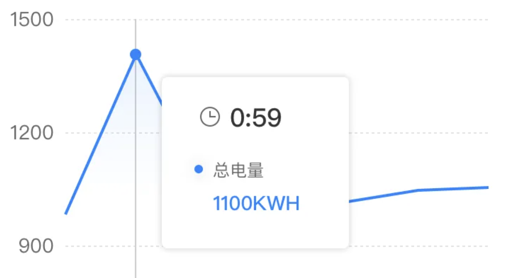
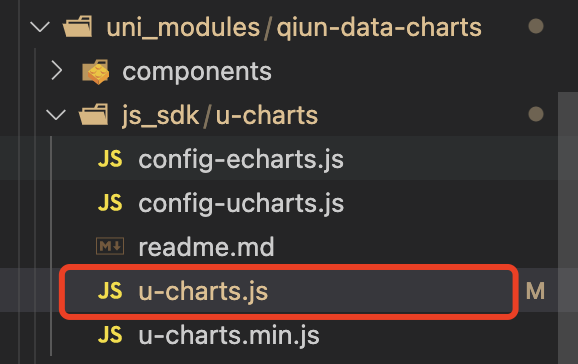
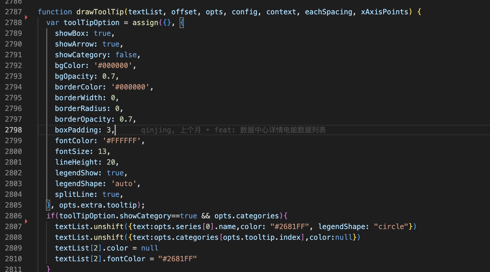
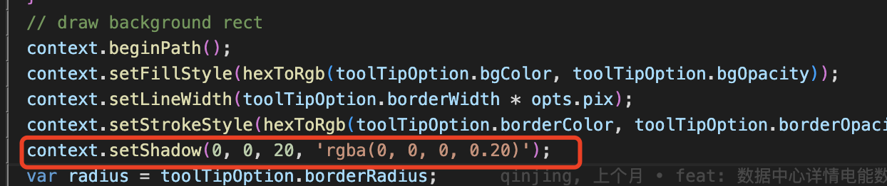
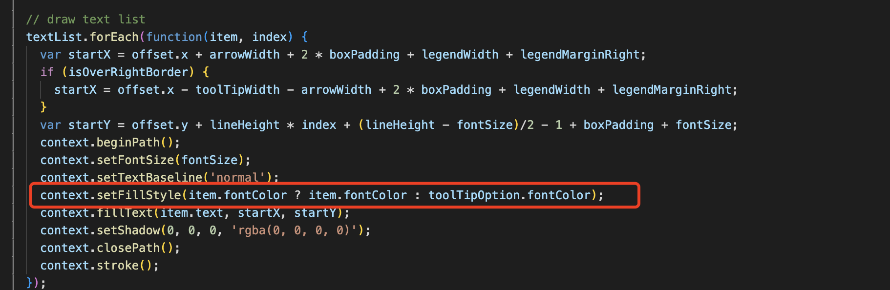
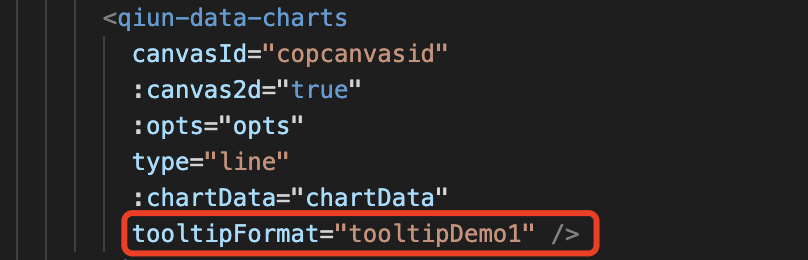
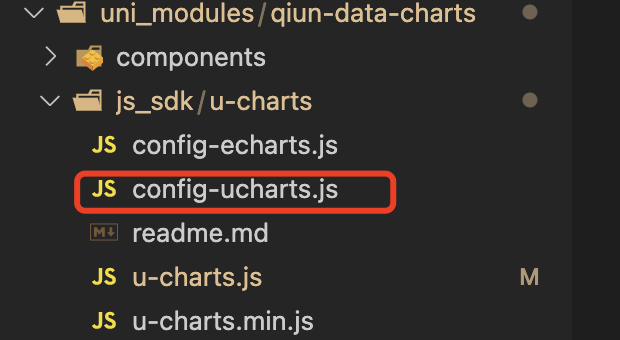
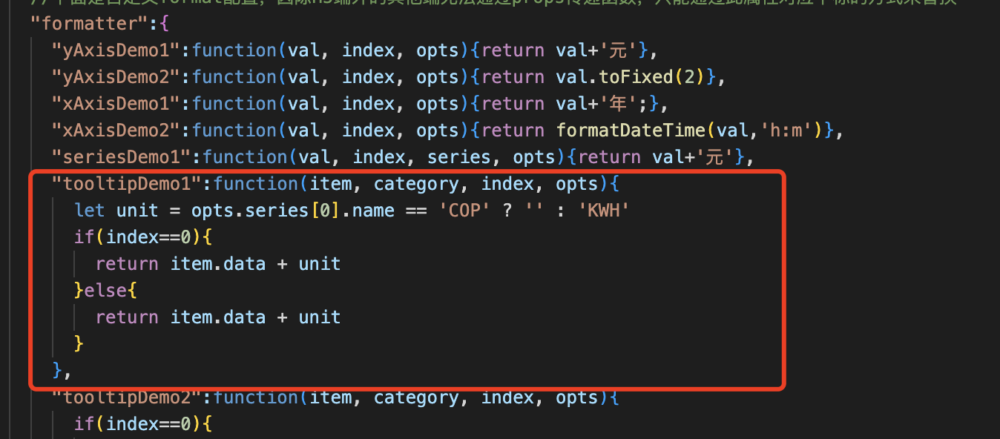

### 原因：Ucharts仅仅使用canvas画图表，他的提示窗也是canvas实现的，然而他给的配置有限，要想实现自定义提示窗那么有一下三种办法

- 第一：更改源码，当然要增加变量隔离，否则作用全局会影响项目中其他的图表
- 第二：官方提供了，tooltipCustom，可以自定义提示窗
- 第三：可以自己写一个html提示框，根据ucharts提供的api，获取用户点击的位置，展示在用户点击的位置

### 这里我用的是第一种方法更改源码，因为我对于提示框更改不大，先上图



#### 这里要改变的是，增加一个icon，icon后面是X轴的值，第二行增加一个Y轴的说明，第三行是Y轴的值以及单位，还有就是整个提示框增加阴影效果

- 首先我们找到他源码中的js文件，这里我是用cli构建的uniapp，如果用Hbuilder构建的uniapp可能位置不一样



- 然后我们找到他画提示窗的函数，drawToolTip



- 可以看到textList就是我们提示窗里面要绘制的内容和配置，他是一个对象数组，数组中的每一项将会单独绘制一行，我这里要绘制三行，所以我在原有的数组前面添加(unshift())两项，textList配置如下

  ```javascript
  [{
    text:'要绘制的文字',
    color: '切记这里的color并不是文字的颜色，文字前面徽标的颜色，文字颜色是单独配置的，当然可以自定义',
    legendShape:'前面徽标的形状，这里我用了circle，也就是圆，当然可以自定义'
  }]
  ```

- 到这里我已经绘制的三行文字了，下面我们绘制提示窗的阴影，还是在这个函数里面，在他绘制矩形的时候我们增加setShadow就行了，这里不多说了，上图



- 接下来我们给我们绘制的文字增加样式，还是在这个函数里面找到他绘制文字的地方，然后增加样式，这里我增加的判断，我在textList增加了一项fontColor，如果textList每项中没有fontColor，那么就用实例进来的fontColor，还有绘制图片也在这里，可以在textList里面自定义配置绘制图片的路径以及是否绘制图片，不所说了，有点基础的都会，上图



- 最后一个问题，我们实例的Y轴数据是没有单位的，当然textList里面可以直接拼接，但是有时候我们不需要自定义提示窗的样式，只需要增加一个单位，那么这样写就会很麻烦，这时候我们就需要官方提供的API，tooltipFormat，我们只需要在dom中增加配置，在配置中增加方法就可以了，上图



找到配置文件，



在配置文件中增加配置，这里我增加了我自己的业务判断



### 还有一个很多人问我的问题，太长了换行怎搞，我们要搞懂他的原理，他是canvas实现的也就是没有 /n等换行符什么的，要想换行只能在textList自行截断字符串，然后增加到textList每一项里面，不光提示窗的文字，其他的文字同理，比如X轴、Y周、图列等