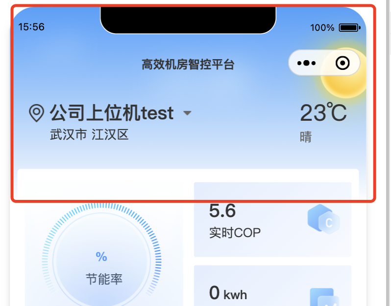
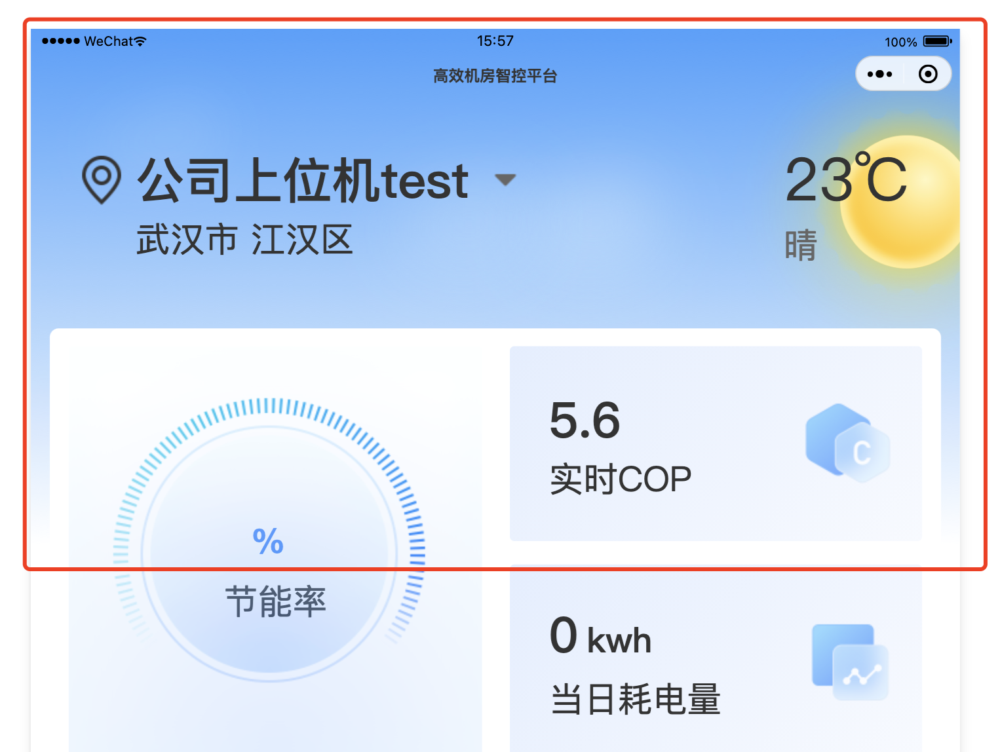
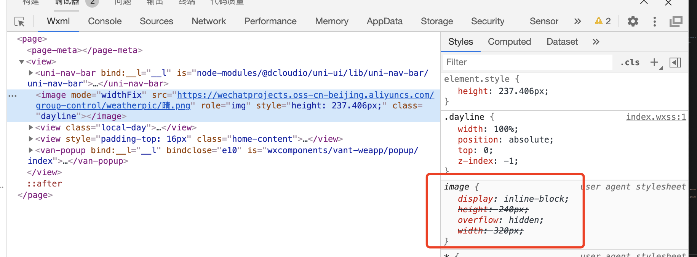
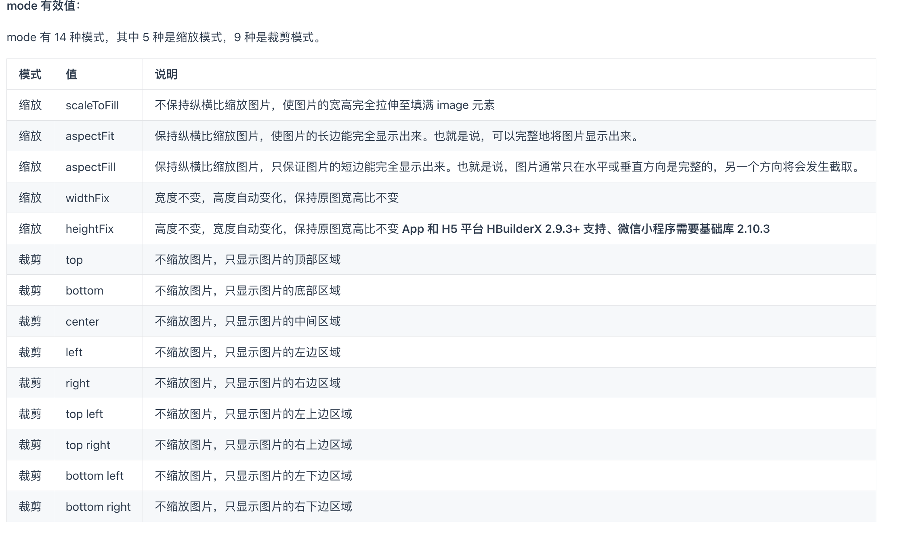

### 原因：小程序不知道background-image，本人开发小程序有个头图，根据天气展示不同的头图，要适配各种宽窄不同的屏幕以及Ipad，不能拉伸图片，UI不同意使用渐变，其实使用宽100%完全可以解决，但是，小程序很坑的是，如果你不设置image的高，他会给你自动设置一个高，效果上图，

这里不生效原因是我设置的mode，否则一直使用这个默认的宽高，

其实image的mode模式允许我们对图片进行裁剪等操作，关于mode值如下

由于本人的需求是靠右上展示图片，所以我的mode值设置的widthFix,并且设置了image宽为100%，如上上图，其中height是widthFix添加的，

