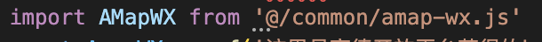
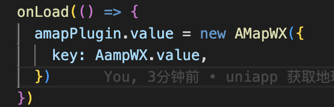
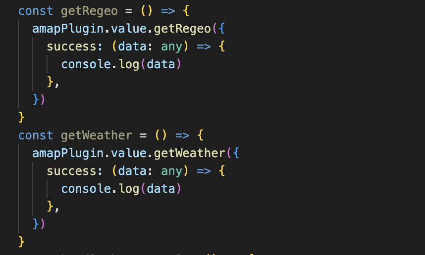
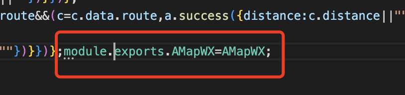
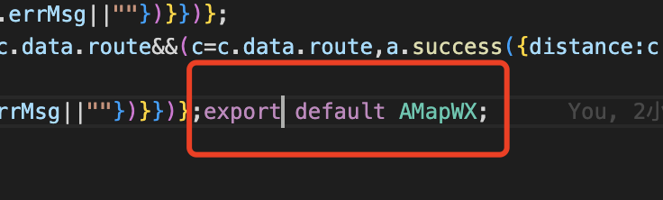

### 小程序获取地理位置只能获取经纬度，如果要转化为中文要借助第三方的SDK（百度，高德），我这里用的高德，下面举例同样用高德

- 首先要获取高德地图SDK的key，（https://lbs.amap.com/api/wx/summary）
- 然后去下载SDK的js文件（https://lbs.amap.com/api/wx/download）
- 引入SDK
- 其实就是一个构造函数，那么我们实例它，
- 调用实例上的方法，我这里调用了天气和地理位置，业务代码可以忽略，

### 特别注意：高德的SDK的导出的方式，没有default，哈哈，然后微信开发工具一直报错，我改成了所以我用了上面的import，巨恶心🤢🤢，其实SDK就是一个构造函数，我们实例化然后调用实例上面的方法就行了，

## 只贴图不上代码不是好程序猿，location.vue里面可以control c/v，😄