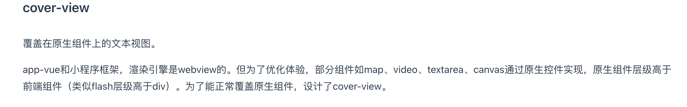

## 一个老生常谈的问题，🥚还是记录一下吧，还记性不如烂笔头，借用uniapp里面的一句解释



这里是官方文档：https://uniapp.dcloud.net.cn/component/cover-view.html#cover-view

上代码

```javascript
<cover-view
        class="button-info">
        这里是内容
</cover-view>
<style>
.button-info {
    position: absolute //	如果不起作用就给他加上这个
}
</style>
```


